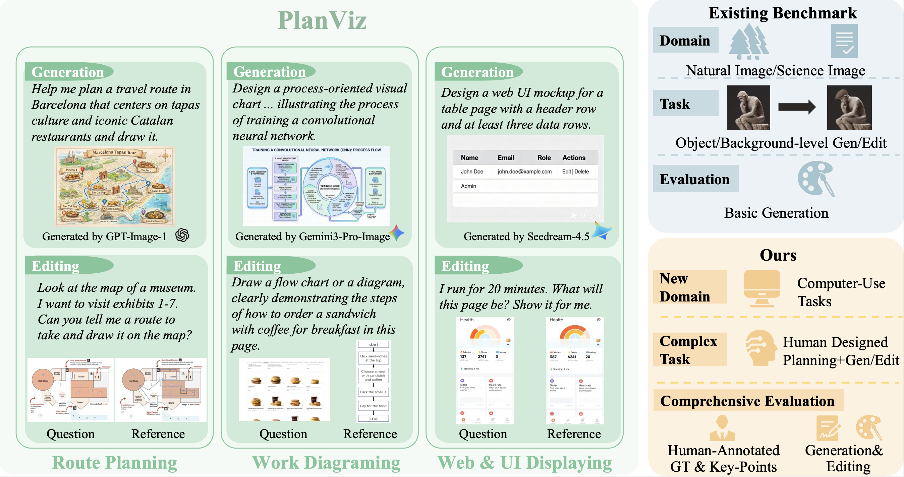
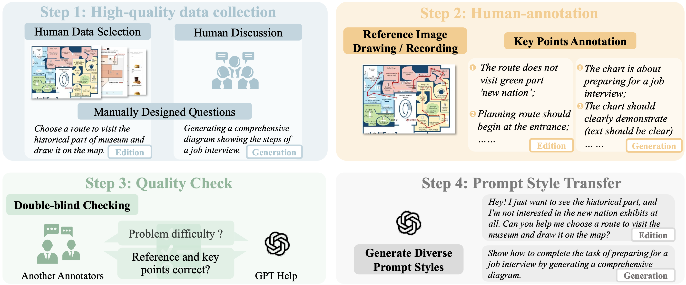

# PlanViz: Evaluating Planning-Oriented Image Generation and Editing for Computer-Use Tasks  

[Junxian Li](https://lijunxian111.github.io), [Kai Liu](https://kai-liu.cn), Leyang Chen, [Weida Wang](), [Zhixin Wang](https://scholar.google.com/citations?user=tZS6bPMAAAAJ&hl=en&oi=sra), [Jiaqi Xu](https://scholar.google.com/citations?hl=en&user=oWvJUfoAAAAJ&view_op=list_works&sortby=pubdate), [Fan Li](https://scholar.google.com/citations?hl=en&user=DRnHw6sAAAAJ), [Renjing Pei](https://scholar.google.com/citations?hl=en&user=zEEMPUUAAAAJ&view_op=list_works&sortby=pubdate), [Linghe Kong](https://scholar.google.com/citations?hl=en&user=-wm2X-8AAAAJ&view_op=list_works&sortby=pubdate), and [Yulun Zhang](https://yulunzhang.com), "PlanViz: Evaluating Planning-Oriented Image Generation and Editing for Computer-Use Tasks", arXiv 2026  

<div>
<a href="https://github.com/lijunxian111/PlanViz/releases" target='_blank' style="text-decoration: none;"></a>
<a href="https://github.com/lijunxian111/PlanViz" target='_blank' style="text-decoration: none;"></a>
<a href="https://github.com/lijunxian111/PlanViz/stargazers" target='_blank' style="text-decoration: none;"></a>
</div>  


[project] [arXiv] [[supplementary material](https://github.com/lijunxian111/PlanViz/releases/tag/v1/arxiv-supple.pdf)] [dataset]


#### 🔥🔥🔥 News

- **2026-02-03:** This repo is released.


---

> **Abstract:** Unified multimodal models (UMMs) have shown impressive capabilities in generating natural images and supporting multimodal reasoning. However, their potential in supporting computer-use planning tasks, which are closely related to our  lives, remain underexplored. Image generation and editing in computer-use tasks require capabilities like spatial reasoning and procedural understanding, and it is still unknown whether UMMs have these capabilities to finish these tasks or not.
> Therefore, we propose PlanViz, a new benchmark designed to evaluate image generation and editing for computer-use tasks. To achieve the goal of our evaluation, we focus on sub-tasks which frequently involve in daily life and require planning steps. Specifically, three new sub-tasks are designed: route planning, work diagramming, and web&UI displaying. We address challenges in data quality ensuring by curating human-annotated questions and reference images, and a quality control process. For challenges of comprehensive and exact evaluation, a task-adaptive score, PlanScore, is proposed. The score helps understanding the correctness, visual quality and efficiency of generated images. Through experiments, we highlight key limitations and opportunities for future research on this topic.



---

### Pipeline



---

## 🔖 TODO

- [ ] Release test data.
- [ ] Provide WebUI.
- [ ] Provide HuggingFace demo.

## 🔗 Contents
1. [Datasets](#datasets)
2. Testing
3. [Results](#results)
4. [Acknowledgements](#acknowledgements)

## <a name="datasets"></a>📦 Datasets

<table border="0">
  <tr>
    <td></td>
    <td></td>
  </tr>
</table>


## <a name="citation"></a>📎 Citation

If you find the code helpful in your research or work, please cite the following paper(s).

```
@article{li2026planviz,
  title={PlanViz: Evaluating Planning-Oriented Image Generation and Editing for Computer-Use Tasks},
  author={Li, Junxian and Liu, Kai and Chen, Leyang and Wang, Weida and Wang, Zhixin and Xu, Jiaqi and Li, Fan and Pei, Renjing and Kong, Linghe and Zhang, Yulun},
  title={arXiv},
  year={2026}
}
```
